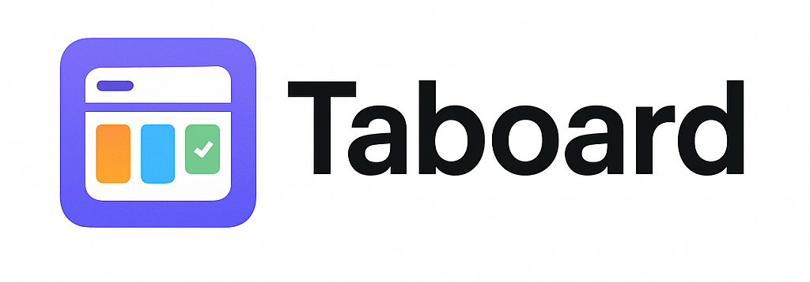

# Taboard

When you open a new tab in Chrome, this extension shows your tab list and a personal kanban board side by side. The left drawer lets you see and manage tabs in the current window, and the right side organizes links, notes, and todos as cards on boards by space. Data is saved in the browser with optional backup/restore via Google Drive.

## What can you do?

- Tab drawer: view/search the current window tabs, click to switch or close. Drag tabs to the board to save them as link cards.
- Spaces/boards/cards: Space → Board (column) → Card structure. Supports card types (link/note/todo), tags, favorites, done state, and drag-and-drop reordering.
- Favorites view: the top ★ tab shows only favorited cards.
- Open all: each board’s `x sites` button opens its link cards at once in a new tab group.
- Quick search/shortcuts: filter cards with the top search box, focus it with `⌘/Ctrl + K`, close modals with `Esc`.
- Backup/restore: auto-saves to `chrome.storage.local`. Connect Google Drive to sync manually or automatically every 30 minutes via `TaboardSync.json`.

## Getting started

- Add a space with the `+` button in the top tab bar; right-click to rename or delete it.
- Inside each space, use `+` to create a board, then `+` inside a board to add cards (link/note/todo).
- Drag tabs from the left drawer to save them as cards, or click a card’s link to open it in a new tab.
- Use the top-right search box to quickly filter cards, and the ★ tab to see only favorites.
- The board header’s `x sites` button opens all link cards in that board as a new tab group.

## Google Drive sync (optional)

1) Click the **Google Drive Sync** button in the top right of the new tab page.  
2) In the Chrome popup, choose your Google account and approve permissions; Drive will create a `TaboardSync.json` file.  
3) Use **Manual sync** in the menu to back up/restore immediately, or keep it connected to auto-back up every 30 minutes.  
4) Choose **Disconnect** in the menu to unlink Drive.

Note: If a company policy blocks Google sign-in popups, Drive sync will be unavailable. Core features work without signing in.

## Permissions

- `tabs`/`tabGroups`: show the current window’s tab list and open multiple links as a new tab group.
- `storage`: store board and card data in the browser.
- `identity` and Google API host permissions: used only for OAuth when backing up/restoring with Google Drive.

## Troubleshooting

- If the new tab page doesn’t appear, click **Reload** for Taboard in `chrome://extensions`.
- If Drive sync errors persist, reload the extension or disconnect and reconnect it from the menu.
